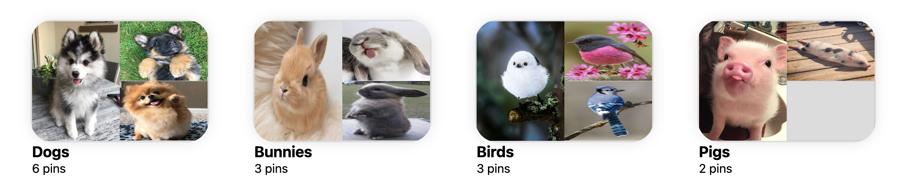

# Overview

[Pinsly](https://pinsly.onrender.com/) is a [Pinterst](https://www.pinterest.com/) clone that allows users to explore ideas and contents in form of pins. Pins are images with description and titles that allow the users to share and describe their ideas. Other users can organize these pins in their own personal  boards. 

# Technologies 
* Javascript
* React
* Redux
* Ruby
* Ruby on Rails
* PostgreSQL
* Webpack
* AWS S3
* Render

# Preview
## Users

Logging In/ Logging Out/ Signing Up
<video width="320" height="240" controls>
  <source src="./images/User-login-signup.mov" type="video/mp4">
</video>

## Boards




Creating and Deleting Board
<video width="320" height="240" controls>
  <source src="./images/Create_Delete_Board.mov" type="video/mp4">
</video>


# Code Snippets
Below is a code snippet of the Board Controller that will Create, Read, Update, and Destroy boards on the backend. These codes communicate with the rails database to activate their specific tasks.
```js
class Api::BoardsController < ApplicationController
    before_action :require_logged_in

    def index
        @boards = Board.where(user_id: params[:user_id])
        render :index
    end

    def show 
        @board = Board.find(params[:id])
        render :show
    end

    def create
        @board = Board.new(board_params)
        @board.user_id = current_user.id 
      
        if @board.save
            render :show
        else 
            render json: {errors: @board.errors.full_messages}, status: :unprocessable_entity
        end
    end

    def destroy
        @board = Board.find(params[:id])
        if @board && @board.user_id == current_user.id
            @board.destroy
            render json: {message: "Board deleted!"}
        else 
            render json: {message: "Unauthorized"}, status: :unauthorized
        end
    end

    def update
        @board = Board.find(params[:id])
        if @board.update(board_params)
            render :show
        else
            render json: @board.errors.full_messages
        end
    end

    private

    def board_params
        params.require(:board).permit(:name, :description)
    end
end
```
Below is a code snippet the Edit Board Modal in the React frontend that will uses React hooks such as useState, useEffect, useDispatch, useSelector, and useParams. It can grab the specific board's saved title and description from the backend to prefill the edit form. Then grab the different slices of state what the user inputs and dispatch it to the backend to edit the information in the database/backend.
```js
function EditBoardModal(props) {
  const { boardId } = useParams();
  const dispatch = useDispatch();
  const board = useSelector(({ boards }) =>
    boards[boardId] ? boards[boardId] : {}
  );

  const [name, setName] = useState(board.name);
  const [description, setDescription] = useState(board.description);

  let setShowEditBoardModal = props.setShowEditBoardModal;

  useEffect(() => {
    dispatch(boardsActions.fetchBoard(boardId));
  }, [boardId]);

  const handleSubmit = (e) => {
    e.preventDefault();
    const data = { ...board, name, description };
    dispatch(boardsActions.updateBoard(data));
    setShowEditBoardModal(false);
  };

  return (
    <Modal onClose={() => setShowEditBoardModal(false)}>
      <div id="editboard-form-modal">
        <h1>Edit your board</h1>
        <form id="editboard-form" onSubmit={handleSubmit}>
          <label>
            Name
            <input
              className="editboardinput"
              type="text"
              value={name}
              placeholder={name}
              onChange={(e) => setName(e.target.value)}
            ></input>
          </label>

          <label>
            Description
            <input
              className="editboardinput"
              type="textarea"
              value={description}
              placeholder={
                description ? description : "What's your board about?"
              }
              onChange={(e) => setDescription(e.target.value)}
            ></input>
          </label>

          <button>Done</button>
        </form>
      </div>
    </Modal>
  );
}
```
# Future Plans
* Finish adding pins to boards and creating/deleting pins
* CSS Styling the Pins exactly like Pinterest with no gaps in between
* Make Comments feature
* Make animated splash page